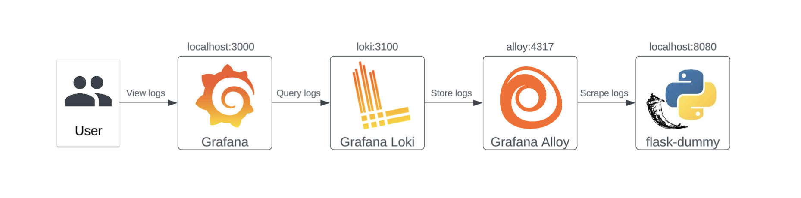

# flask-dummy

This project locally sets up flask-dummy application which is using Grafana Alloy to send logs to Loki. The results can be validated by viewing logs in Grafana

## Project Structure

```sh
├── configs
│   ├── grafana
│   │   ├── dashboard.json
│   │   └── dashboards.yaml
│   ├── config.alloy
│   └── loki-config.yaml
├── flask-dummy
│   ├── Dockerfile
│   ├── app.py
│   └── requirements.txt
├── README.md
├── docker-compose.yaml
└── run_app.sh
```

## Prerequisites

- Docker
- Docker Compose

## Getting Started

1. Clone the repository:

   ```sh
   git clone git@github.com:darya-korobenko/flask-dummy.git
   cd flask-dummy
   ```

2. Execute `run_app.sh` script which is going to:
- Build and start the application usind docker-compose.yaml
- Test the Flask application with GET and POST requests
- Open Grafana dashboard in the default web browser to view the results

3. Stop the services by running `docker-compose down`

## Services



### flask-dummy
- **Description**: A Flask application that listens on `localhost:8080` and sends logs to `alloy:4317` via GRPC.
- **Files**:
  - `flask-dummy/app.py`: Contains the Flask application code.
  - `flask-dummy/requirements.txt`: Lists the Python dependencies required to run the Flask application.
  - `flask-dummy/Dockerfile`: Dockerfile to build the Flask application.

### alloy
- **Description**: Collects logs from the `flask-dummy` service and exports them to Loki.
- **File**:
  - `./configs/config.alloy`: Configuration file for Grafana Alloy.

### loki
- **Description**: Responsible for storing the collected logs.
- **File**:
  - `./configs/loki-config.yaml`: Configuration file for Loki.

### grafana
- **Description**: Provides a web interface to visualize the logs collected by Loki, listens on `localhost:3000`.
- **Files**:
  - `./configs/grafana/dashboards.yaml`: Provisioning configuration for Grafana dashboards.
  - `./configs/grafana/dashboard.json`: JSON file for flask-dummy Grafana dashboard.

## Testing
The `run_app.sh` script includes functions to test the Flask application with GET and POST requests.
